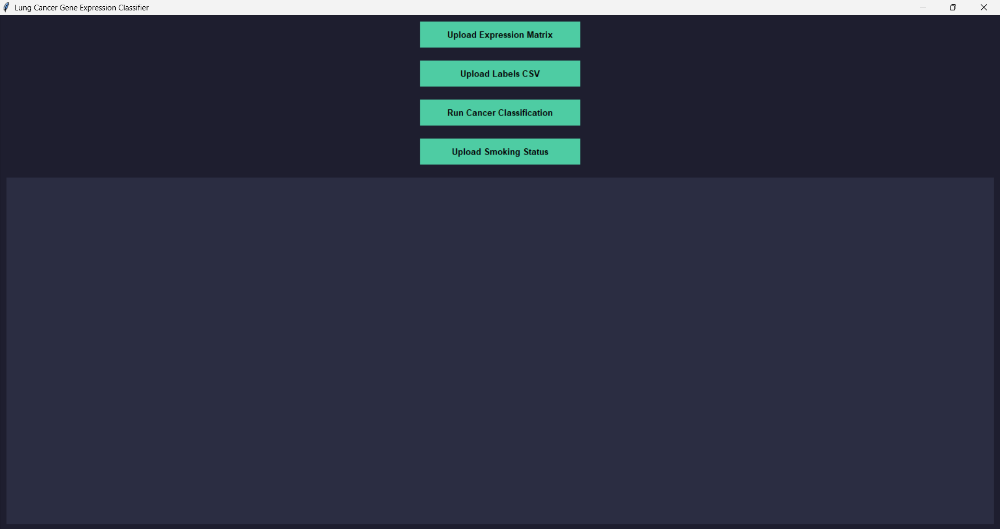
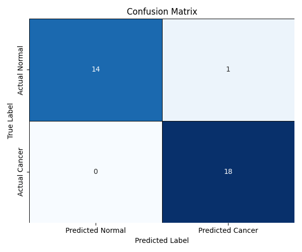
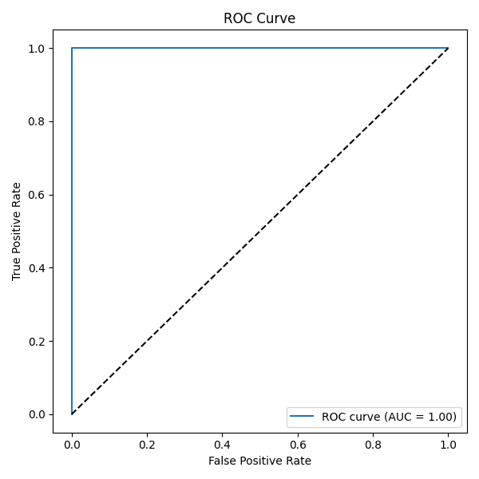
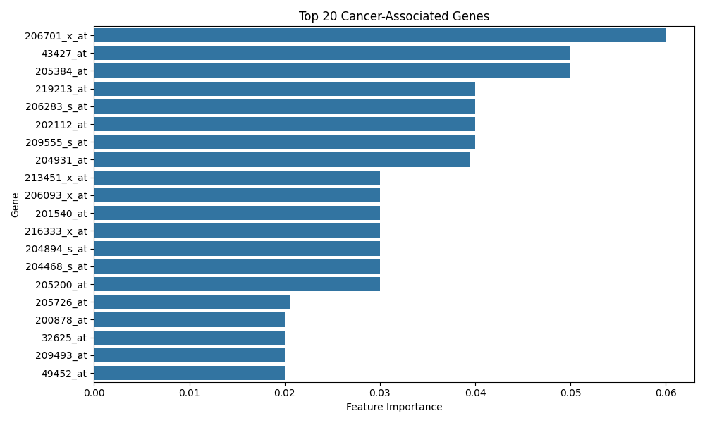

# OncoGene Classifier: Lung Cancer Prediction via Gene Expression

## 📋 Project Overview
OncoGene Classifier is a bioinformatics tool designed to classify lung cancer samples using gene expression data. Developed with a Python-based GUI, it integrates **Random Forest** machine learning with **ANOVA-based feature selection** to identify key biomarkers and provide high-accuracy diagnostic predictions.

---

## 📊 Results & Performance
The following visualizations are generated automatically and stored in the `/Results` directory:

### 1. Model Validation
The classifier's reliability is validated using a **Stratified K-Fold** approach. The ROC curve and Confusion Matrix demonstrate the model's precision in distinguishing between malignant and normal tissue.

| Classification Metrics | Prediction Confidence |
|:---:|:---:|
|  |  |
| *Figure 1: Confusion Matrix* | *Figure 2: ROC Curve (AUC Analysis)* |

### 2. Biomarker Identification
The pipeline utilizes feature selection to rank the most statistically significant genes. These top 20 genes represent prioritized biomarkers for lung cancer research.

*Figure 3: Top 20 Genes prioritized by the model.*

---

## 🚀 Key Features
* **Interactive GUI:** Built with `Tkinter` for seamless data uploading and analysis.
* **Intelligent Preprocessing:** Automatic detection of file orientation and **Standard Scaling** for high-dimensional genomic data.
* **Robust Machine Learning:** Utilizes a Random Forest Classifier with cross-validation.
* **Clinical Correlation:** Includes analysis of smoking status to provide environmental context to genomic findings.

## 📂 Repository Structure
* **`LungCancerPredictionViaGeneExpression.py`**: Main application script.
* **`Results/`**: Directory containing all diagnostic plots and visualizations.
* **`labels.csv`**: Sample classification labels.
* **`smoking status.csv`**: Clinical metadata for correlation analysis.
* **`requirements.txt`**: List of required Python libraries.

## 🔬 Technical Methodology
* **Data Preparation:** Expression matrices are normalized using StandardScaler.
* **Feature Selection:** High-variance features are filtered to optimize model performance.
* **Training:** The model is trained using StratifiedKFold to ensure balanced learning across classes.
* **Evaluation:** Performance is measured via Accuracy Scores, ROC/AUC, and Classification Reports.
